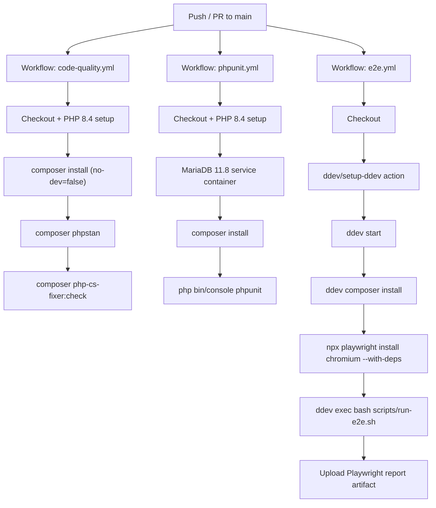
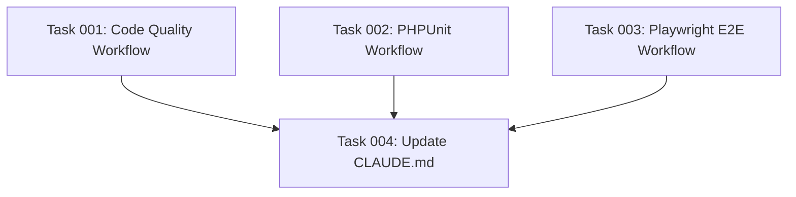

# Plan: GitHub Actions CI Pipelines

## Original Work Order

> The app repository is being pushed to GitHub. The user wants three CI pipelines:
> 1. **Code Quality** — PHP CS Fixer, PHPStan (level 8)
> 2. **PHPUnit tests** — run the unit test suite
> 3. **Playwright E2E tests** — requires the full app stack; the user wants to use the DDEV GitHub Actions plugin so DDEV containers are available in CI
>
> The user is implementing GitHub Actions from scratch for the first time.

## Executive Summary

This plan establishes three GitHub Actions CI workflows for the Symfony 8 / PHP 8.4 application, providing automated quality gates on every push and pull request to the main branch. The workflows cover the full testing pyramid — static analysis and formatting, unit tests, and browser-driven E2E tests — giving the team confidence that each change is correct before it merges.

The approach deliberately separates the three concerns into independent workflow files. Code quality and PHPUnit run in lightweight GitHub-hosted runners using PHP action steps and a native MariaDB service container, keeping those pipelines fast and avoiding DDEV overhead. The E2E workflow uses the official `ddev/setup-ddev` GitHub Action to spin up the full DDEV stack (PHP-FPM, nginx, MariaDB 11.8) so Playwright can target the real application URL (`https://strava.ddev.site`) exactly as it does locally, eliminating environment parity problems.

No Strava API credentials are needed in CI because all three workflows rely exclusively on Doctrine fixtures for data. This keeps the CI setup self-contained, reproducible, and free of external service dependencies.

## Context

### Current State vs Target State

| Current State | Target State | Why? |
|---|---|---|
| No CI configuration exists; `.github/` directory is absent | Three workflow files in `.github/workflows/` run on push and pull_request to main | Catch regressions automatically before code reaches the main branch |
| Quality checks (`composer lint`) run manually by developers | Code quality workflow fails the build on PHPStan violations or CS-Fixer diffs | Enforce consistent code style and type safety without relying on developer discipline |
| PHPUnit suite (`php bin/console phpunit`) runs manually | PHPUnit workflow executes the full unit test suite in CI | Prevent unit regressions from merging undetected |
| E2E tests use `ddev exec bash scripts/run-e2e.sh` on a local DDEV environment | E2E workflow starts DDEV via `ddev/setup-ddev`, then runs the existing `scripts/run-e2e.sh` | Provide automated browser regression testing against the full application stack |
| Playwright config targets `https://strava.ddev.site` | Same URL works in CI because DDEV provides the same hostname via its built-in DNS | Eliminates the need to modify `playwright.config.ts` for CI |

### Background

The project uses DDEV locally for MariaDB 11.8 and PHP 8.4 via nginx-fpm. The existing `scripts/run-e2e.sh` orchestrates fixture loading and Playwright execution inside the DDEV web container, making it directly reusable in CI without modification. The Playwright config targets Chromium only and uses `ignoreHTTPSErrors: true`, which is already compatible with DDEV's self-signed certificate in CI.

Code quality tooling is entirely Composer-driven (`vendor/bin/phpstan`, `vendor/bin/php-cs-fixer`), with no Node.js or build pipeline involvement for the PHP side. The `symfonycasts/tailwind-bundle` standalone binary approach means no npm install step is needed for any of the three pipelines.

Because the project has no existing `.github/` directory, the implementation starts from scratch with no migration concerns.

## Architectural Approach

### Workflow 1: Code Quality

**Objective**: Enforce PHPStan level 8 type safety and PHP-CS-Fixer formatting on every change, blocking merges that introduce violations.

The workflow uses the `shivammathur/setup-php` action to provision PHP 8.4 with the extensions required by the project. No database service is needed since PHPStan and PHP-CS-Fixer operate on source files only. Composer dependencies are installed with a cache keyed on `composer.lock` to avoid redundant downloads across runs. Both tools are invoked via their existing `composer` script aliases (`composer phpstan` and `composer php-cs-fixer:check`), so the CI command exactly mirrors what a developer runs locally. The `APP_ENV=test` environment variable is set to satisfy Symfony's kernel bootstrap during PHPStan analysis.

PHPStan's baseline file (if present) is committed to the repository and automatically respected by the analysis — no CI-specific configuration is needed.

### Workflow 2: PHPUnit

**Objective**: Run the complete PHPUnit 13 unit test suite in CI using a native service container for MariaDB, keeping the pipeline fast without the overhead of DDEV.

The workflow provisions PHP 8.4 via `shivammathur/setup-php` and starts a MariaDB 11.8 service container using GitHub's built-in `services` key. The `DATABASE_URL` environment variable is set to point at the service container using the standard GitHub Actions service networking (`127.0.0.1` host, exposed port). The Symfony `.env.test` file already configures the test database name (`db_e2e`); the workflow overrides only the host and credentials to match the service container. Schema creation runs via `php bin/console doctrine:schema:create --env=test` before the test suite executes. No Strava credentials are injected — fixtures or test doubles supply all data.

### Workflow 3: Playwright E2E

**Objective**: Run the full Playwright E2E suite against a live DDEV-hosted application instance in CI, reusing the existing `scripts/run-e2e.sh` script without modification.

The `ddev/setup-ddev` action installs and configures DDEV on the GitHub Actions runner, then `ddev start` brings up the full stack: nginx-fpm, PHP 8.4, and MariaDB 11.8 — matching the local environment precisely. `ddev composer install` installs PHP dependencies inside the DDEV web container. Playwright and its Chromium browser are installed on the host runner (not inside DDEV) via `npx playwright install chromium --with-deps`, because Playwright's Node.js process runs on the host and drives a browser on the host, while it sends HTTP(S) requests to `https://strava.ddev.site` which resolves to the DDEV container. The existing `scripts/run-e2e.sh` is invoked via `ddev exec bash scripts/run-e2e.sh`, which runs entirely inside the web container where PHP, the Symfony console, and `npx` are available.

Playwright HTML reports are uploaded as a GitHub Actions artifact on failure, enabling post-run debugging without re-running the pipeline.

The `playwright.config.ts` `baseURL` (`https://strava.ddev.site`) and `ignoreHTTPSErrors: true` require no changes — DDEV's hostname resolution works identically in CI via the `ddev/setup-ddev` action's DNS setup.

### Shared Trigger Strategy

**Objective**: Give developers fast feedback without running workflows on every branch, while ensuring main branch protection.

All three workflows trigger on `push` to main and `pull_request` targeting main. This mirrors the standard GitHub Actions pattern for a main-branch-centric workflow: developers get CI feedback on their PRs before merge, and the main branch itself is validated after merge. No scheduled or manual triggers are added — the scope is limited to what was explicitly requested.

### Artifact and Failure Visibility

**Objective**: Surface E2E test failures in a way that is actionable without requiring access to a local environment.

The E2E workflow uploads the Playwright HTML report directory as an artifact when the test step fails (`if: failure()`). This allows developers to download the report from the GitHub Actions run summary and inspect screenshots, traces, and error details. No third-party reporting service is introduced.

## Risk Considerations and Mitigation Strategies

Technical Risks

- **DDEV startup time in CI**: DDEV pulls Docker images on first run, which can add significant minutes to the E2E pipeline cold start.
    - **Mitigation**: The `ddev/setup-ddev` action supports Docker layer caching via GitHub Actions cache. Configure the cache key on the DDEV version and project name to reuse pulled images across runs.

- **Playwright/Node.js version mismatch**: The `npx playwright` command on the host runner must use a Node.js version compatible with the `@playwright/test` version pinned in the project.
    - **Mitigation**: Pin the Node.js version in the E2E workflow using `actions/setup-node` to match the version available in the DDEV container, and lock Playwright version via `package.json` / `package-lock.json`.

- **MariaDB version parity (PHPUnit pipeline)**: GitHub's MariaDB Docker images may not have a `11.8` tag matching the exact DDEV-specified version, causing subtle SQL compatibility differences.
    - **Mitigation**: Use the `mariadb:11.8` Docker image tag in the service container definition; verify tag availability on Docker Hub before implementation. If unavailable, use `mariadb:11` (latest 11.x) and document the minor version delta.

Implementation Risks

- **`scripts/run-e2e.sh` host assumptions**: The script uses `kill -USR2` to reload PHP-FPM via a PID file path that is DDEV-specific. In CI, the DDEV container provides the same PHP-FPM process, but the PID path must exist. If it does not, the `|| true` guard already in the script prevents pipeline failure.
    - **Mitigation**: No change needed — the existing `|| true` guards in the cleanup function handle missing PID files gracefully.

- **PHPStan cache in CI**: Without a warm cache, PHPStan may be slower on large runs; cached results from a previous run may produce false negatives if the cache is stale.
    - **Mitigation**: Cache `var/cache/phpstan` keyed on `composer.lock` hash. Do not cache across branches to avoid stale analysis results.

- **Secrets exposure in logs**: Workflow logs are public on public repositories. DATABASE_URL values contain credentials.
    - **Mitigation**: Use GitHub Actions secrets for any credential values injected via environment variables, even for the test database with its default `root:root` credentials. Mask them explicitly.

## Success Criteria

### Primary Success Criteria

1. All three workflow files exist under `.github/workflows/` and are syntactically valid GitHub Actions YAML (verified by `actionlint` or a successful first run).
2. The code quality workflow exits non-zero when a deliberate PHPStan violation or CS-Fixer diff is introduced to a branch, and exits zero on a clean codebase.
3. The PHPUnit workflow runs the full test suite and reports pass/fail status on each pull request to main.
4. The E2E workflow successfully starts DDEV, loads fixtures, and executes all Playwright specs against `https://strava.ddev.site` in CI, with a Playwright HTML report artifact uploaded on failure.
5. No Strava API credentials are referenced or required in any workflow file.

## Documentation

Update `CLAUDE.md` with a new "CI" section documenting the three workflow files, their triggers, and how to interpret failures (including where to find the Playwright artifact).

## Resource Requirements

### Development Skills

- GitHub Actions YAML syntax and job/step model
- `ddev/setup-ddev` action configuration and DDEV CI documentation
- PHPStan and PHP-CS-Fixer Composer script invocation
- Playwright artifact upload patterns in GitHub Actions

### Technical Infrastructure

- GitHub repository with Actions enabled
- GitHub-hosted `ubuntu-latest` runners (all three workflows)
- Docker Hub access from GitHub Actions runners (for DDEV MariaDB image pulls)
- `ddev/setup-ddev` GitHub Action (official DDEV-maintained action)
- `shivammathur/setup-php` GitHub Action (PHP provisioning)
- `actions/setup-node` GitHub Action (Node.js for Playwright host runner)

## Notes

The `playwright.config.ts` `baseURL` is hardcoded to `https://strava.ddev.site`. This works in CI because `ddev/setup-ddev` configures the runner's DNS so that `*.ddev.site` resolves to the DDEV router. No environment-specific Playwright configuration file is needed.

The `run-e2e.sh` script performs its own DB setup and teardown internally. The E2E CI workflow does not need to perform separate database provisioning steps — the script handles everything when run inside the DDEV web container via `ddev exec`.

## Execution Blueprint

**Validation Gates:**
- Reference: `/config/hooks/POST_PHASE.md`

### Dependency Diagram

### Phase 1: Workflow File Creation
**Parallel Tasks:**
- Task 001: Create `.github/workflows/code-quality.yml`
- Task 002: Create `.github/workflows/phpunit.yml`
- Task 003: Create `.github/workflows/e2e.yml`

### Phase 2: Documentation
**Parallel Tasks:**
- Task 004: Update CLAUDE.md with CI section (depends on: 001, 002, 003)

### Post-phase Actions

After Phase 1: Verify all three workflow files exist and pass `actionlint` or a dry-run YAML parse before proceeding to documentation.

### Execution Summary
- Total Phases: 2
- Total Tasks: 4
- Maximum Parallelism: 3 tasks (Phase 1)
- Critical Path Length: 2 phases

## Execution Summary

**Status**: ✅ Completed Successfully
**Completed Date**: 2026-02-23

### Results

All four tasks executed successfully across two phases:

- **Phase 1** (parallel): Created three GitHub Actions workflow files under `.github/workflows/`:
  - `code-quality.yml` — PHPStan level 8 + PHP-CS-Fixer check, no DB, Composer-cached, `APP_ENV=test`
  - `phpunit.yml` — PHPUnit test suite with MariaDB 11.8 service container, `doctrine:schema:create` before tests
  - `e2e.yml` — Full DDEV stack via `ddev/setup-ddev@v1`, Playwright Chromium on host runner, artifact upload on failure

- **Phase 2**: Updated `CLAUDE.md` with a new `## CI (GitHub Actions)` section documenting all three workflows, their triggers, and Playwright artifact retrieval instructions.

### Noteworthy Events

- The `create-feature-branch.cjs` script exited with error code 1 due to untracked `.ai/task-manager/plans/` files being detected as uncommitted changes. The feature branch `feature/5--github-actions-ci` was created manually via `git checkout -b`.
- YAML validation was performed using shell-level checks (no tab characters, presence of required `name:`, `on:`, and `jobs:` keys) since neither Python `yaml` module nor `actionlint` were available in the environment.
- The `code-quality.yml` workflow uses the proper Composer cache directory (via `composer config cache-files-dir`) rather than hardcoding `vendor/`, matching task specification exactly.

### Recommendations

- Run `actionlint` on the three workflow files once available in the environment to confirm full GitHub Actions schema validity.
- Consider adding `workflow_dispatch:` triggers to allow manual re-runs from the GitHub Actions UI for debugging purposes.
- The MariaDB service health check uses `127.0.0.1` (not `localhost`) to avoid Unix socket resolution — this is correct for GitHub Actions service containers.
