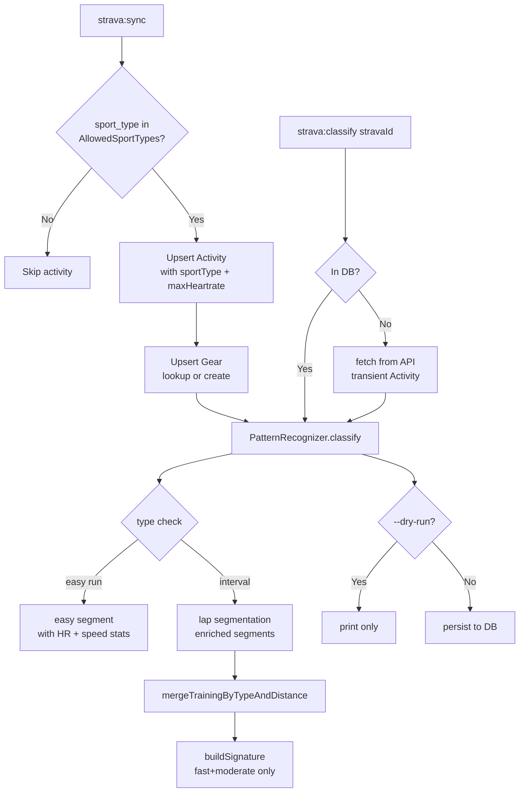
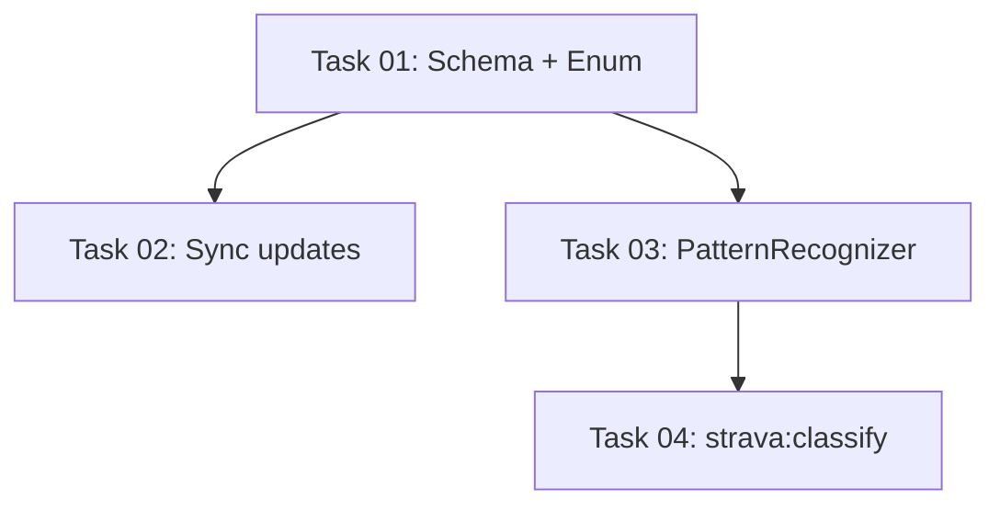

# Plan: Pattern Recognizer Refinement

## Original Work Order

> The patternrecognizer service needs to be refined a bit. I would like to change how the signature is generated and the buttons segments should be made in a different way. For search runs and lock runs, I think that we may need to create a single item whose type is a easy and include all the information. For other items declared as interval, we need to organize it in a different way. I will give you some examples of how they are categorized now with the button signature, button segments, how I would like to have them classified. Besides that, I think that we need a new command that will allow to categorize an activity by their Strava ID. In this way, we could test if the new recognition system works as expected.
>
> 17350255705 4x1km + 8km [{"type": "warmup", ...}, {"type": "recovery", ...}, {"type": "fast", "distance_m": 1000.0, "count": 1}, ... x4, {"type": "moderate", "distance_m": 8000.0, "count": 8}, {"type": "colddown", ...}]
>
> 17294287895 2x6km [{"type": "warmup", ...}, {"type": "recovery", ...}, {"type": "moderate", "distance_m": 6000.0, "count": 6}, {"type": "recovery", ...}, {"type": "moderate", "distance_m": 6000.0, "count": 6}, {"type": "recovery", ...}, {"type": "cooldown", ...}]

**Refinement request:**
> we need to update the data schema to add a new column for the Equipment used for the activity so we can define the pair of tools that being used I don't know if you want to prefer to use different table for it or not also we need to filter out the activities and only include the run, ultra-run, extra activity types in the app exclude others like swimming or riding please use them as a class constant and also we need to modify a bit the pattern segments item signature to include besides the type, distance and count a few new fields like the average speed, average heart rate and maximum heart rate for the new console command we need to include also the ability to persist the changes it should be the default option

## Plan Clarifications

| Question | Answer |
|---|---|
| What signature format should short/long runs use? | "easy {N}km" using the **floor** function for distance (e.g., 9312m → "easy 9km") |
| What should the `strava:classify` command do for unknown Strava IDs? | Fetch from the Strava API, classify, and display result |
| Gear storage: separate table or inline columns? | Separate `Gear` entity/table with ManyToOne relationship on Activity |
| Which Strava sport types to include? | `Run`, `TrailRun`, `VirtualRun`, `UltraMarathon` |
| Per-segment heartrate source for stream-based segments? | Laps only — stream-based segments leave `avg_heartrate`/`max_heartrate` as null |
| Flag to skip persisting in `strava:classify`? | `--dry-run` |

## Executive Summary

This plan addresses five related improvements to the Strava activity tracking application. First, the `PatternRecognizer` service is updated so that easy runs produce a single `"easy"` segment with a floored distance and a human-readable `"easy 9km"` signature, while interval workouts merge non-consecutive same-type training segments (including `moderate` tempo blocks, not just `fast`) into compact signatures like `"4×1km + 8km"`. Second, each stored segment is enriched with `avg_speed`, `avg_heartrate`, and `max_heartrate` sourced from the raw lap data. Third, a new `Gear` entity is introduced as a separate table so multiple activities can reference the same gear (shoes/tools), enabling future gear-based analysis. Fourth, activity-type filtering is added using a PHP enum (or class constant) allowlist (`Run`, `TrailRun`, `VirtualRun`, `UltraMarathon`) so that swims, rides, and other non-running activities are skipped during sync. Fifth, the new `strava:classify {stravaId}` command persists the classification result by default, with a `--dry-run` flag to print-only.

The `Gear` relationship requires a new database table and a migration. All other changes are confined to the `PatternRecognizer`, `StravaSyncCommand`, `StravaClient`, and `Activity` entity. No Twig template changes are needed.

## Context

### Current State vs Target State

| Aspect | Current State | Target State | Why? |
|---|---|---|---|
| Short/long run segments | `patternSegments = null` | `[{"type":"easy","distance_m":<floored>,"count":1,"avg_speed":…,"avg_heartrate":…,"max_heartrate":…}]` | Consistent segment structure with stats |
| Short/long run signature | `"short_run"` / `"long_run"` | `"easy 9km"` / `"easy 15km"` (floor) | Carries meaningful distance information |
| Training segments in signature | `fast` + `recovery` only | `fast` + `moderate` (recovery excluded from signature) | Tempo blocks are training; recovery is just the gap |
| Non-consecutive segment merging | Consecutive same-type only | Non-consecutive same-type same-distance merged with `count` | "4×1km" instead of four separate "1km fast" entries |
| Segment fields | `type`, `distance_m`, `count` | + `avg_speed`, `avg_heartrate`, `max_heartrate` | Richer data for comparison views |
| Equipment tracking | None | `Gear` entity; `Activity` has nullable ManyToOne `gear` | Enable per-shoe analysis |
| Activity type filtering | Hardcoded `type=Run` in API call | PHP enum allowlist + runtime filter | Include Trail, Virtual, Ultra runs; exclude swims/rides |
| Max heartrate on Activity | Not stored | `maxHeartrate` (float, nullable) added to Activity | Needed for easy-segment HR stat |
| `strava:classify` command | Does not exist | Exists; persists by default; `--dry-run` to skip | Fast testing of recognition logic |

### Background

The PatternRecognizer treated `fast`+`recovery` as the only training segment types; `moderate` tempo blocks were unmatchable. Merging was consecutive-only, producing verbose signatures. Short/long runs stored no segment data at all.

The sync command was hard-coded to fetch only `type=Run` (deprecated Strava parameter), silently excluding trail runs, virtual runs, and ultra events the user wants tracked.

No gear data was captured, making shoe-rotation analysis impossible.

The `max_heartrate` field returned by Strava's API was discarded; it is needed to compute the heartrate stat for easy-run segments.

## Architectural Approach

### Gear Entity and Schema

**Objective**: Store equipment (shoes, etc.) referenced by Strava activities in a deduplicated table.

A new `Gear` entity (`src/Entity/Gear.php`) with:
- `id` (int, auto-increment PK)
- `stravaGearId` (string 50, unique) — Strava's gear ID string (e.g. `g123456`)
- `name` (string 255)

`Activity` gains:
- `gear` — nullable `ManyToOne` relationship to `Gear` (join column `gear_id`, nullable)
- `sportType` — string 50, nullable — stores the Strava `sport_type` value (e.g. `"TrailRun"`)
- `maxHeartrate` — float, nullable — populated from Strava's `max_heartrate` activity field

Gear records are created or looked up by `stravaGearId` during sync. The Strava detailed-activity response includes a `gear` object with `id` and `name`; no separate gear API call is needed.

### Activity Type Filtering

**Objective**: Only sync/classify activities whose sport type is in the app's allowlist; use class constants, not magic strings.

A PHP enum `App\Strava\AllowedSportType` (backed string enum) with cases:
- `Run = 'Run'`
- `TrailRun = 'TrailRun'`
- `VirtualRun = 'VirtualRun'`
- `UltraMarathon = 'UltraMarathon'`

A static helper `AllowedSportType::values(): array` returns all case values for filtering.

`StravaClient::getActivities()` removes the hardcoded `'type' => 'Run'` filter (fetching all types from the API). `StravaSyncCommand` checks `sport_type` against `AllowedSportType::values()` and skips non-matching activities.

### PatternRecognizer — Signature and Segment Refinement

**Objective**: Better signatures for easy runs; compact signatures for intervals; `moderate` included as training; segments enriched with stats.

**Easy runs** (`short_run` / `long_run`):
- `$easyDistance = floor($distance / 1000) * 1000`
- `patternSegments = [['type'=>'easy','distance_m'=>$easyDistance,'count'=>1,'avg_speed'=>$activity->getAverageSpeed(),'avg_heartrate'=>$activity->getAverageHeartrate(),'max_heartrate'=>$activity->getMaxHeartrate()]]`
- `patternSignature = "easy " . ($easyDistance/1000) . "km"`

**Interval segments** (lap-based):
When building labeled segments from laps, each entry carries:
- `avg_speed`: `average_speed` from the lap
- `avg_heartrate`: `average_heartrate` from the lap (nullable)
- `max_heartrate`: `max_heartrate` from the lap (nullable)

When `mergeSameType()` merges consecutive segments of the same type, it computes a distance-weighted average for `avg_speed` and `avg_heartrate`, and takes the max of `max_heartrate`.

**Stream-based segments**: `avg_speed` is computed from the stream; `avg_heartrate` and `max_heartrate` are `null`.

**Signature building**: `extractTrainingSegments()` returns `fast` + `moderate` (not `recovery`). A new private method `mergeTrainingSegmentsByTypeAndDistance()` groups non-consecutive same-type same-rounded-distance training segments into a single entry with summed `count`. Signature format: `"N×Xkm"` (count > 1) or `"Xkm"` (count == 1), parts joined with `" + "`.

### `strava:classify` Console Command

**Objective**: Test recognition on any Strava activity; persist by default; `--dry-run` to print only.

Command: `strava:classify {stravaId} [--dry-run]`

1. Look up `stravaId` in `ActivityRepository`
2. If not found: fetch via `StravaClient::getActivity()` + `getActivityStreams()`, hydrate a transient `Activity`
3. Run `PatternRecognizer::classify()`
4. Print `patternType`, `patternSignature`, `patternSegments` (JSON pretty-print)
5. Unless `--dry-run`: persist/flush the activity

## Risk Considerations and Mitigation Strategies

Technical Risks

- **Stale existing DB records**: Activities synced before this change will have old signatures (`"short_run"`) and no gear/sportType data.
  - **Mitigation**: User runs `strava:sync --full` after deployment to reclassify everything.

- **Non-consecutive merge over-grouping**: Two `moderate` segments at the same distance might be logically distinct.
  - **Mitigation**: `applyWarmupCooldown()` already relabels the first/last `moderate` as `warmup`/`cooldown`, so only internal `moderate` segments reach the merge step.

- **Gear object absent from Strava response**: Not all activities have gear set.
  - **Mitigation**: `gear` is nullable; the sync skips gear upsert when `gear_id` is absent.

Implementation Risks

- **`haveSamePattern()` comparison**: After changing `extractTrainingSegments()` from `[fast, recovery]` to `[fast, moderate]`, the comparison now operates on moderate segments — which can be longer (6km) and may differ slightly.
  - **Mitigation**: The existing 10% `segmentTolerance` threshold handles typical GPS drift.

- **Deprecated `type` param removed from API call**: Fetching all activity types increases API response size.
  - **Mitigation**: The rate-limit logic already handles large syncs; incremental sync is unaffected as only new activities are fetched.

## Success Criteria

### Primary Success Criteria
1. Activity 17350255705 classifies with signature `"4×1km + 8km"` and lap-based segments enriched with avg_speed/HR
2. Activity 17294287895 classifies with signature `"2×6km"`
3. A 10km easy run produces signature `"easy 10km"` and a single easy segment with HR stats
4. Trail runs and virtual runs are synced; swim/ride activities are skipped
5. Each activity in the DB has a `gear` reference when Strava gear data is available
6. `strava:classify {id}` persists the result; `strava:classify {id} --dry-run` prints only

## Resource Requirements

### Development Skills
- PHP 8.4 (backed enum, Doctrine ORM, Symfony console)
- Doctrine migrations

### Technical Infrastructure
- Existing DDEV environment (MariaDB, PHP 8.4)
- Existing Strava API credentials and `StravaClient` service

## Execution Blueprint

**Validation Gates:**
- Reference: `/config/hooks/POST_PHASE.md`

### Phase 1: Schema and Enum ✅
**Parallel Tasks:**
- Task 01: Create Gear entity, update Activity schema, add AllowedSportType enum, generate migration

### Phase 2: Sync and Algorithm ✅
**Parallel Tasks:**
- Task 02: Update StravaSyncCommand (sport-type filter, gear upsert, maxHeartrate) (depends on: 01)
- Task 03: Refine PatternRecognizer signature, segment merging, and segment stats (depends on: 01)

### Phase 3: Classify Command ✅
**Parallel Tasks:**
- Task 04: Implement strava:classify command with persist-default + --dry-run (depends on: 03)

### Execution Summary
- Total Phases: 3
- Total Tasks: 4
- Maximum Parallelism: 2 tasks (Phase 2)
- Critical Path Length: 3 phases

## Notes

### Change Log
- 2026-02-19: Initial plan created for PatternRecognizer refinement + strava:classify command
- 2026-02-19: Refinement pass — added Gear entity, AllowedSportType enum, segment HR stats, persist-by-default on classify command; restructured into 4 tasks across 3 phases
