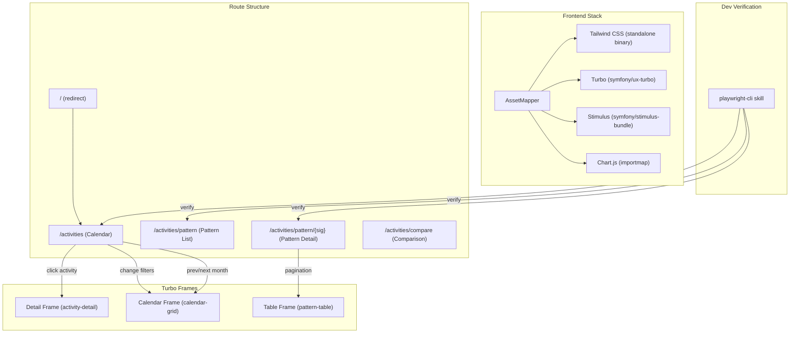
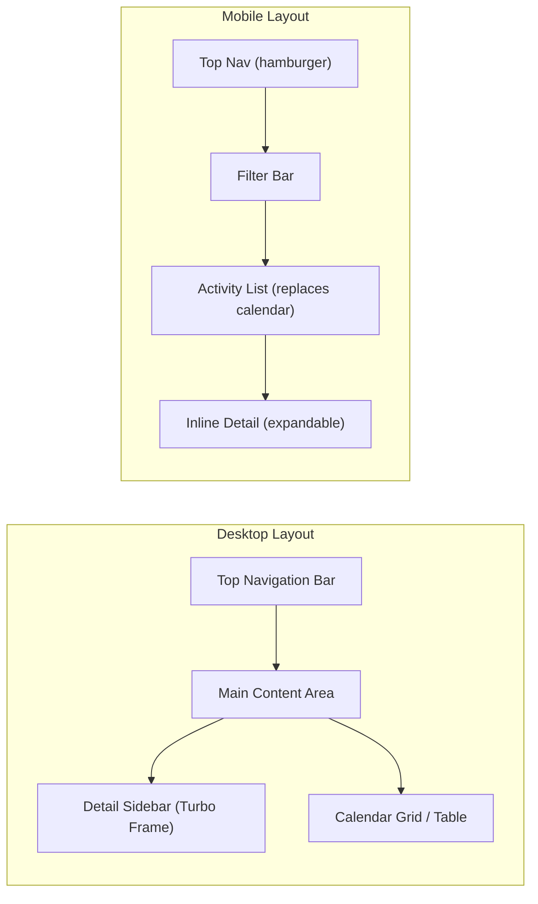
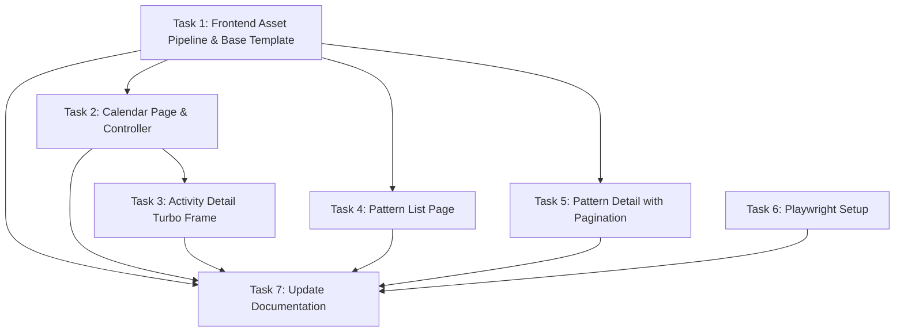

# Plan: Frontend Redesign with Tailwind CSS, Turbo, and Calendar View

## Original Work Order

> The user wants to:
> 1. Use Tailwind CSS for styles and Turbo (Hotwire) for dynamic reloading
> 2. Reorganize routes under `/activities`:
>    - New calendar page at `/activities` (or `/activities/calendar`)
>    - Move current `/activities` content to `/activities/pattern`
> 3. Calendar page: monthly calendar showing activities, with dropdown filters (pattern signature, gear), activity detail panel on the left when clicked
> 4. Pattern list page (`/activities/pattern`): alphabetical list of patterns with sortable tables showing last 5 items per group
> 5. Pattern detail page (`/activities/pattern/{signature}`): sortable, paginated (25/page) table with columns: date, name, distance, pace, duration, avg HR, gear
> 6. Strava-like styling

## Plan Clarifications

| Question | Answer |
|----------|--------|
| Should `/activities` render the calendar directly or redirect to `/activities/calendar`? | `/activities` renders the calendar directly. `/` redirect to `/activities` stays. |
| Should the activity detail panel use Turbo Frames? | Yes, Turbo Frame for the detail panel (no full page reload). |
| Multiple activities per day: show all or individual icons? | Individual icons, each clickable. |
| Frontend build tooling preference? | Symfony AssetMapper + `symfonycasts/tailwind-bundle` (no Node.js). |
| Keep the comparison feature with Chart.js? | Yes, preserve comparison feature and Chart.js. |
| Calendar activity icons: color-coded or uniform? | Color-coded by pattern type. |
| Mobile responsiveness required? | Yes, calendar collapses to a list view on mobile. |
| "Last 5 items" in pattern list means what? | 5 most recent activities by date per pattern group. |
| How should Playwright be used for frontend verification? | Use the `playwright-cli` skill to verify layout, Turbo frames, and responsiveness via automated browser interactions. No manual npm setup required. |
| Where should Playwright be installed? | Already available via the `playwright-cli` skill. No project-level `package.json` or npm devDependency needed. |

## Executive Summary

This plan redesigns the Strava Analyser frontend to replace the current unstyled HTML with a modern, Strava-inspired interface built on Tailwind CSS and Hotwire (Turbo + Stimulus). The primary change is introducing a calendar-first experience at `/activities` that shows a monthly grid of running activities with color-coded icons by pattern type, dropdown filters for pattern signature and gear, and a Turbo Frame-powered detail panel that appears when an activity is clicked. The existing pattern-grouped activity list moves to `/activities/pattern` with an improved alphabetical layout showing the 5 most recent activities per group.

The technical approach uses Symfony AssetMapper with the `symfonycasts/tailwind-bundle` for CSS and `symfony/ux-turbo` with `symfony/stimulus-bundle` for dynamic page updates. This avoids introducing a Node.js build pipeline while leveraging Symfony's native asset management. AssetMapper maps importmap-based JavaScript modules, and Tailwind is compiled via a standalone binary managed by the bundle.

Key benefits include a significantly improved user experience with instant navigation via Turbo, a visual calendar overview that mirrors how athletes think about their training (by date), and responsive design that works on mobile devices. The existing comparison feature and Chart.js visualizations are preserved unchanged.

## Context

### Current State vs Target State

| Current State | Target State | Why? |
|---|---|---|
| No CSS framework; raw unstyled HTML tables | Tailwind CSS with Strava-inspired design tokens | Professional look matching the fitness/athletics domain |
| No frontend build system or asset pipeline | Symfony AssetMapper + Tailwind bundle + Stimulus | Modern asset management without Node.js complexity |
| Full page reloads on every navigation | Turbo Drive for navigation, Turbo Frames for panels | Faster, app-like user experience |
| `/activities` shows pattern-grouped list | `/activities` shows monthly calendar with activity icons | Calendar-first view matches how athletes review training |
| No calendar view exists | Monthly calendar with color-coded icons, filters, detail panel | Visual overview of training frequency and patterns |
| Pattern list at `/activities` | Pattern list at `/activities/pattern` | Clear separation between calendar and pattern views |
| Pattern detail shows all activities in one unsorted table | Sortable, paginated table (25/page) with gear column | Better data exploration for patterns with many activities |
| No filtering capability | Dropdown filters for pattern signature and gear | Focused views of specific training types or gear |
| No mobile support | Responsive: calendar collapses to list on mobile | Accessible on phones where athletes commonly check data |
| Chart.js loaded via CDN `<script>` tag | Chart.js managed via importmap/AssetMapper | Consistent dependency management |

### Background

The application currently has four templates (`base.html.twig`, `index.html.twig`, `pattern_group.html.twig`, `comparison.html.twig`) with no styling framework. The Activity entity has all fields needed for the redesign: `activityDate`, `name`, `distance`, `averageSpeed`, `elapsedTime`, `averageHeartrate`, `patternSignature`, `patternType`, and a `ManyToOne` relationship to `Gear`. The `ActivityRepository` has `findGroupedByPattern()` and `findByPatternSignature()` methods that will need to be extended with new queries for calendar data retrieval and filtered/paginated results.

The screenshot reference shows a monthly calendar grid with days of the week as columns, small colored running figure icons on days with activities, and a left sidebar for navigation. This design serves as the visual target, adapted to the Strava Analyser's data model and Strava-like color palette.

## Architectural Approach

The redesign introduces three layers of change: a frontend asset pipeline (AssetMapper + Tailwind + Turbo), restructured routes and controllers, and new Twig templates with Turbo Frame integration. The architecture preserves the existing backend logic (PatternRecognizer, sync commands, comparison controller) while reshaping how data is presented.

### Component 1: Frontend Asset Pipeline Setup

**Objective**: Establish the Symfony AssetMapper, Tailwind CSS, Turbo, and Stimulus foundation that all templates will build upon.

Install `symfony/asset-mapper`, `symfonycasts/tailwind-bundle`, `symfony/ux-turbo`, and `symfony/stimulus-bundle` via Composer. Configure AssetMapper to serve from an `assets/` directory with importmap support. The Tailwind bundle manages a standalone Tailwind CLI binary (no npm required) and compiles from a `tailwind.config.js` that references Twig template paths for class purging. Define a Strava-inspired Tailwind theme with a color palette (Strava orange `#FC4C02`, dark backgrounds, neutral grays) and typography scale. Stimulus controllers will live in `assets/controllers/` and be auto-discovered by the bundle. Chart.js will be added to the importmap to replace the current CDN script tag. The base template (`base.html.twig`) will be rebuilt to include the AssetMapper entry point, Tailwind stylesheet, Turbo meta tags, and a responsive navigation bar with links to Calendar and Patterns.

### Component 2: Calendar Page and Controller

**Objective**: Build the new default view at `/activities` showing a monthly calendar grid with color-coded activity icons and interactive filters.

Create a new `calendar` action on `ActivityController` (replacing the current `list` action's route) that accepts optional query parameters for `month`, `year`, `pattern`, and `gear`. The controller queries activities for the requested month, groups them by day, and also fetches distinct pattern signatures and gear names for filter dropdowns. The Twig template renders a 7-column CSS Grid calendar (Monday-Sunday) with day cells containing small colored icons for each activity. Icons are color-coded by `patternType` using a Tailwind color map (e.g., steady = blue, intervals = orange, tempo = red, long_run = green, unclassified = gray). Each icon is a link targeting the `activity-detail` Turbo Frame. Prev/next month arrows target the `calendar-grid` Turbo Frame for seamless month navigation. Filter dropdowns (pattern signature, gear) submit to the same route and also target the `calendar-grid` frame. On mobile (below Tailwind's `md` breakpoint), the calendar collapses to a chronological list of activities for the month. A new repository method retrieves activities for a given year/month with optional pattern and gear filters, eagerly loading the Gear relation.

### Component 3: Activity Detail Turbo Frame

**Objective**: Display activity details in a side panel when a calendar activity icon is clicked, without full page reload.

Define a Turbo Frame with id `activity-detail` in the calendar template, positioned as a left sidebar on desktop (fixed-width column in a Tailwind flex/grid layout) and as a slide-up panel or inline expandable section on mobile. Create a new controller action (e.g., `/activities/{id}/detail`) that returns a partial Twig template wrapped in a matching `<turbo-frame id="activity-detail">` tag. The partial displays: activity name, date, distance, pace, duration, average HR, max HR, gear name, pattern type, and pattern signature. Include a link to view the full pattern group. When no activity is selected, the frame shows a placeholder message ("Click an activity to see details"). A Stimulus controller manages the visual "selected" state on the calendar icon.

### Component 4: Pattern List Page

**Objective**: Move the current grouped-activities view to `/activities/pattern` with improved alphabetical layout and limited preview rows.

Restructure the existing `list` action to serve at `/activities/pattern` as the pattern list page. Query all distinct pattern signatures with their activity counts, ordered alphabetically. For each pattern group, fetch only the 5 most recent activities (by date descending). Render each group as a card or section with the pattern signature as heading, activity count, and a compact sortable table (date, name, distance, pace, avg HR). Client-side sorting via a Stimulus controller that reorders table rows on header click (no server round-trip needed for 5 rows). Each group header links to the full pattern detail page. Unclassified activities appear at the bottom.

### Component 5: Pattern Detail Page with Pagination

**Objective**: Enhance the pattern detail view with sortable columns, server-side pagination at 25 items per page, and a gear column.

Update the `patternGroup` action to accept `page` and `sort`/`direction` query parameters. Implement server-side pagination using Doctrine's `setFirstResult`/`setMaxResults` with a page size of 25. Add sorting support for all table columns: date, name, distance, pace (derived from averageSpeed), duration, avg HR, and gear name. The table is wrapped in a Turbo Frame (`pattern-table`) so pagination and sort links trigger partial updates. Column headers render as clickable links that toggle sort direction. Pagination controls (prev/next/page numbers) target the same frame. Preserve the existing comparison checkbox feature: selected activity IDs are tracked via a Stimulus controller and submitted to `/activities/compare`. The gear column displays the associated Gear entity's name or a dash if null. Trend text computation remains unchanged.

### Component 6: Playwright Development Verification Setup

**Objective**: Verify frontend changes in a real browser using the `playwright-cli` skill, without manual npm setup or writing automated tests.

The `playwright-cli` skill provides browser automation capabilities for navigating web pages, taking screenshots, interacting with elements, and extracting information. No project-level `package.json` or npm devDependency is needed — the skill handles browser management internally.

**Usage pattern**: After implementing frontend changes, invoke the `playwright-cli` skill to navigate to `https://strava.ddev.site/activities` (or any route) and verify the page. This allows verifying: Tailwind CSS styling renders correctly, Turbo Frame interactions work (calendar navigation, detail panel loading, pagination), responsive layout behavior at different viewport sizes, and filter/sort interactivity.

**Key verification scenarios**:
- Calendar page renders with color-coded activity icons and month navigation works via Turbo
- Clicking an activity icon loads the detail panel in the Turbo Frame sidebar
- Pattern list and detail pages display sortable tables with correct data
- Mobile viewport shows the calendar collapsed to a list view
- Comparison feature with Chart.js still functions after the redesign

No changes to `.gitignore`, `package.json`, or `package-lock.json` are needed for Playwright.

### Component 7: Responsive Layout and Strava-like Styling

**Objective**: Apply consistent Strava-inspired visual design across all pages with full mobile responsiveness.

Define the visual language in `tailwind.config.js` with Strava's brand orange as the primary accent, a clean white/light-gray background, and dark text. Navigation uses a top bar with the app name and page links, highlighted with the accent color for the active page. Tables use alternating row backgrounds, hover states, and compact padding. The calendar grid uses rounded day cells with subtle borders. Activity icons are small SVG running figures or colored dots. Responsive breakpoints: below `md` the calendar switches to a vertical list, the detail panel moves below the calendar, and tables become horizontally scrollable. All interactive elements (filter dropdowns, sort headers, pagination links) have clear hover and focus states for accessibility.

## Risk Considerations and Mitigation Strategies

Technical Risks

- **AssetMapper + Tailwind bundle compatibility with Symfony 8.0**: The `symfonycasts/tailwind-bundle` and `symfony/ux-turbo` may not yet have stable releases for Symfony 8.0.
    - **Mitigation**: Verify package compatibility before starting. If the Tailwind bundle does not support Symfony 8, use the standalone Tailwind CLI directly with a Composer script and a manual `tailwind.config.js`.

- **Turbo Frame interactions with Chart.js**: Chart.js canvases may not reinitialize properly when loaded inside Turbo Frames due to lifecycle differences.
    - **Mitigation**: The comparison page (which uses Chart.js) will use a full Turbo Drive navigation rather than Turbo Frames, ensuring Chart.js initializes normally on page load. Add a Stimulus controller to handle Chart.js initialization if needed.

Implementation Risks

- **Calendar performance with many activities per month**: Months with high activity counts could result in crowded calendar cells with many icons.
    - **Mitigation**: Limit visible icons per day cell (e.g., show up to 3 icons with a "+N more" indicator) and load details on demand via Turbo Frame.

- **Client-side sorting limitations on pattern list**: Stimulus-based table sorting must handle formatted values (pace as "X:XX min/km", distance as "X.X km").
    - **Mitigation**: Store raw numeric values as `data-sort-value` attributes on table cells so the Stimulus controller sorts by numeric value rather than display text.

- **Migration of existing templates**: Replacing all four templates simultaneously risks breaking the comparison flow.
    - **Mitigation**: Build new templates alongside existing ones, update routes incrementally, and verify the comparison feature works end-to-end before removing old templates.

## Success Criteria

### Primary Success Criteria

1. `/activities` renders a monthly calendar grid showing color-coded activity icons with working prev/next month navigation via Turbo
2. Clicking a calendar activity icon loads the activity detail in a Turbo Frame sidebar without full page reload
3. Pattern signature and gear dropdown filters update the calendar grid via Turbo Frame
4. `/activities/pattern` displays all pattern groups alphabetically with the 5 most recent activities each, and client-side sortable columns
5. `/activities/pattern/{signature}` displays a paginated (25/page) sortable table with all specified columns including gear, with pagination and sorting via Turbo Frame
6. The comparison feature at `/activities/compare` continues to work with Chart.js visualizations
7. All pages are styled with Tailwind CSS in a Strava-inspired design
8. Calendar collapses to a chronological list on viewports below Tailwind's `md` breakpoint
9. All existing PHPStan level 8 checks and PHP-CS-Fixer formatting pass
10. No Node.js or npm is required in the build process or for frontend verification
11. The `playwright-cli` skill can be used for browser verification of all key pages

## Documentation

- Update `CLAUDE.md` to document the new route structure, frontend stack (AssetMapper, Tailwind, Turbo, Stimulus), and any new Composer scripts for Tailwind compilation
- Update the "Web Routes" section in `CLAUDE.md` to reflect the new `/activities` (calendar), `/activities/pattern`, and `/activities/pattern/{signature}` routes
- Add the `assets/` directory structure to the "Project Structure" section
- Document `playwright-cli` skill usage for frontend verification

## Resource Requirements

### Development Skills

- Symfony controller and Twig templating with Turbo Frame integration
- Tailwind CSS utility-class design and responsive breakpoints
- Stimulus controller development for client-side interactivity (sorting, selection state)
- Doctrine QueryBuilder for filtered, paginated, and date-range queries

### Technical Infrastructure

- `symfony/asset-mapper` -- native Symfony asset pipeline with importmap
- `symfonycasts/tailwind-bundle` -- standalone Tailwind CSS compilation without Node.js
- `symfony/ux-turbo` -- Turbo Drive and Turbo Frames integration for Symfony
- `symfony/stimulus-bundle` -- Stimulus controller auto-discovery and loading
- Chart.js (existing, migrated to importmap)
- `playwright-cli` skill -- browser verification tool (no npm dependency needed)

## Integration Strategy

The redesign preserves all existing backend services unchanged: `PatternRecognizer`, `ActivitySyncProcessor`, `StravaClient`, sync/classify commands. The `ComparisonController` remains as-is with updated template styling. The `ActivityRepository` gains new query methods (calendar month query, paginated pattern query) alongside existing methods. New Composer dependencies are additive. The `base.html.twig` is rebuilt but maintains the same Twig block structure (`title`, `stylesheets`, `content`, `scripts`) so child templates follow the same extension pattern.

## Notes

- The Tailwind standalone binary is platform-specific; the `symfonycasts/tailwind-bundle` handles downloading the correct binary for the development environment (Linux via DDEV)
- The existing `pace_format` and `duration_format` Twig extensions continue to be used in all table templates
- Pattern type color mapping should be defined centrally (e.g., as a Twig global or a shared Stimulus value) so the calendar icons and pattern list use consistent colors

### Change Log
- 2026-02-19: Added Component 6 (Playwright Development Verification Setup) per user request. Added Playwright clarifications to Q&A table. Updated success criteria, resource requirements, and documentation sections. Renumbered Responsive Layout component to 7.
- 2026-02-19: Generated 7 tasks and appended execution blueprint.
- 2026-02-20: Updated all Playwright references to use `playwright-cli` skill instead of npm-based `@playwright/test` setup.

## Dependency Diagram

## Execution Blueprint

**Validation Gates:**
- Reference: `/config/hooks/POST_PHASE.md`

### ✅ Phase 1: Foundation & Independent Setup
**Parallel Tasks:**
- ✔️ Task 1: Frontend Asset Pipeline & Base Template
- ✔️ Task 6: Playwright Setup

### ✅ Phase 2: Page Implementations
**Parallel Tasks:**
- ✔️ Task 2: Calendar Page & Controller (depends on: 1)
- ✔️ Task 4: Pattern List Page (depends on: 1)
- ✔️ Task 5: Pattern Detail Page with Pagination (depends on: 1)

### ✅ Phase 3: Calendar Detail Integration
**Parallel Tasks:**
- ✔️ Task 3: Activity Detail Turbo Frame (depends on: 2)

### Phase 4: Documentation
**Parallel Tasks:**
- Task 7: Update Documentation (depends on: 1, 2, 3, 4, 5, 6)

### Post-phase Actions
- Run `ddev composer lint` to verify PHPStan and PHP-CS-Fixer pass
- Run `ddev exec php bin/console tailwind:build` to verify Tailwind compiles
- Browser verification with `playwright-cli` skill on all key pages

### Execution Summary
- Total Phases: 4
- Total Tasks: 7
- Maximum Parallelism: 3 tasks (in Phase 2)
- Critical Path Length: 4 phases (1 → 2 → 3 → 7)
