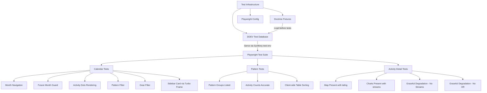
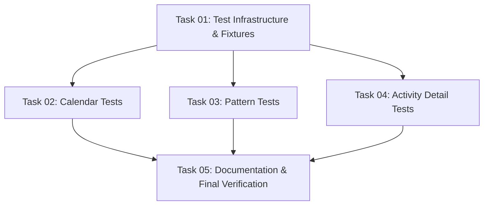

# Plan: Playwright End-to-End Tests

## Original Work Order

> We need to implement Playwright end-to-end tests in the application. I would like to test the behavior of the calendar, pattern, and activity detail pages. For the calendar, I would like to test the calendar itself that navigates back and forth, that it cannot be shown or navigated to a month that is in the future, and for the months that have activities confirmed that the activities are printed properly. I also would like to test the behavior of the filters above the calendar for both the pattern and the gear, and the behavior of the card on the left side. For the patterns page, just confirm that the data is accurate and the lists are being shown. For the detailed page, we need to confirm that the map and the charts are present for those activities that have the data, and if any activity does not have the data, the map is fully degraded and is not shown. Please implement the Playwright tests and confirm that everything is okay and ensure that in the future these tests are being executed at the end of the plan to confirm that no regressions are introduced.

## Plan Clarifications

| Question | Answer |
|---|---|
| Run inside DDEV or host? | Install Playwright as project dependency (`@playwright/test`) |
| Test data strategy? | Create Doctrine fixtures with known test data |
| "Card on the left side"? | The activity sidebar card loaded via Turbo Frame when clicking a calendar dot |
| Fixture dataset size? | ~20-25 activities across 4-5 months, 3-4 patterns, 3 gear items, with/without streams |
| Test database engine? | Separate MariaDB database in DDEV |
| Include comparison page? | No, skip for now |

## Executive Summary

This plan introduces Playwright E2E tests to the Strava activity tracker application. The tests will validate user-facing behavior across three core pages: the calendar view, the pattern listing, and the activity detail page.

The approach involves four key pieces: (1) setting up Playwright as a project dependency with a proper configuration targeting the DDEV site, (2) creating a dedicated MariaDB test database in DDEV with Doctrine fixtures providing ~20-25 realistic activities, (3) writing focused E2E test suites covering navigation, filtering, data rendering, and graceful degradation, and (4) integrating these tests into the task manager workflow so they run as a regression check at the end of future plans.

## Context

### Current State vs Target State

| Current State | Target State | Why? |
|---|---|---|
| No E2E tests exist | Playwright test suite covering 3 core pages | Catch UI regressions before they reach users |
| No test fixtures | Doctrine fixtures with ~25 realistic activities | Enable repeatable, deterministic testing |
| Single development database | Separate test database alongside dev DB | Prevent test data from polluting real synced data |
| No Node.js tooling in project | `package.json` with `@playwright/test` | Provide browser automation infrastructure |
| No regression checks in task workflow | E2E tests run at end of future plans | Ensure new features don't break existing behavior |

### Background

The application currently has only PHPUnit unit tests for pattern recognition logic. All data comes from live Strava API syncs — there are no fixtures or seeders. The frontend uses Turbo Frames for partial page updates, Stimulus controllers for client-side interactivity, Chart.js for data visualization, and Leaflet for maps. These dynamic elements require browser-based testing that PHPUnit cannot provide.

The application runs in DDEV with MariaDB 11.8. Symfony AssetMapper + importmap deliver all JS/CSS without a Node.js build step. The `playwright-cli` skill is available for ad-hoc browser verification, but a proper test suite provides repeatable, automated validation.

## Architectural Approach

### Test Database and Fixtures

**Objective**: Provide a deterministic, isolated dataset for E2E tests without affecting development data.

A separate MariaDB database will be configured in DDEV (e.g., `db_test`) alongside the existing development database. Symfony's `test` environment will use a dedicated `DATABASE_URL` pointing to this database. A Doctrine fixtures class will populate ~20-25 activities with the following coverage:

- **Temporal spread**: Activities across 4-5 months (e.g., October 2025 through February 2026), ensuring calendar navigation tests have months with and without data
- **Pattern diversity**: 3-4 pattern groups — at least one with 5+ activities (for pagination testing on pattern detail), one with 2-3, one with a single activity, and a few unclassified activities
- **Gear variety**: 3 different gear items distributed across activities
- **Stream data coverage**: Activities with full streams (latlng + heartrate + velocity_smooth), partial streams (velocity_smooth only, no heartrate), and no streams at all — enabling map/chart presence and degradation testing
- **Edge cases**: Activities with null averageHeartrate, null gear, null patternSignature

A Symfony console command or the standard `doctrine:fixtures:load` mechanism will load fixtures into the test database. A shell script or Makefile target will orchestrate: reset test DB → load fixtures → run Playwright.

### Playwright Setup

**Objective**: Install and configure Playwright as a project dependency with a config targeting the DDEV-served application.

A `package.json` will be created at the project root with `@playwright/test` as a dev dependency. The `playwright.config.ts` will:

- Set `baseURL` to `https://strava.ddev.site` (the DDEV site URL)
- Configure a single browser (Chromium) for speed — additional browsers can be added later
- Set reasonable timeouts for page loads (Turbo Frame navigation can be slow)
- Configure test directory to `tests/e2e/`
- Ignore HTTPS certificate errors (DDEV uses self-signed certs)

Tests will be organized in `tests/e2e/` with one file per page area: `calendar.spec.ts`, `patterns.spec.ts`, `activity-detail.spec.ts`.

### Calendar Page Tests

**Objective**: Validate calendar rendering, month navigation, future-month guard, filter behavior, and sidebar card interaction.

Tests will cover:

- **Month navigation**: Click "Previous month" and verify the heading changes; click "Next month" to return. Verify navigation uses Turbo Frames (no full page reload).
- **Future month guard**: When viewing the current month, verify the "Next month" control is disabled (`aria-disabled="true"`, rendered as `` not `<a>`). Navigate to a month before the current one and verify "Next month" is an active link.
- **Activity rendering**: Navigate to a known month with activities and verify activity dots appear in the calendar grid. Verify distance labels are shown on dots. Verify the correct number of activities for the month.
- **Pattern filter**: Select a pattern from `#filter-pattern`, verify the calendar reloads (Turbo Frame) showing only activities matching that pattern. Verify "Clear filters" link appears.
- **Gear filter**: Select a gear from `#filter-gear`, verify filtering works similarly.
- **Combined filters**: Apply both pattern and gear filters simultaneously.
- **Clear filters**: Click "Clear filters" and verify all activities reappear.
- **Sidebar card**: Click an activity dot, verify the `turbo-frame#activity-detail` loads with activity details (name, date, distance, pace, pattern badge). Verify the "View Activity" link appears (since it's a Turbo Frame context). Verify clicking a different dot updates the sidebar.

### Pattern Page Tests

**Objective**: Verify pattern groups are listed with accurate data, activity counts, and client-side sorting works.

Tests will cover:

- **Pattern groups rendered**: Verify all expected pattern groups appear on `/activities/pattern`.
- **Activity counts**: Verify each group shows the correct number of activities.
- **Activity data in tables**: Verify activity names, dates, distances, and paces are displayed in sortable tables within each group.
- **Client-side sorting**: Click a column header and verify rows reorder correctly (e.g., sort by distance ascending/descending).
- **Pattern detail navigation**: Click a pattern signature link and verify it navigates to the detail page.
- **Pattern detail page**: Verify the paginated table shows activities for the selected pattern. Verify sort links work (server-side, via Turbo Frame). If the pattern has enough activities, verify pagination renders with proper page numbers.

### Activity Detail Page Tests

**Objective**: Verify map, charts, and card render correctly when data is available, and degrade gracefully when data is missing.

Tests will cover:

- **Activity with full data** (latlng + velocity_smooth + heartrate): Verify `#activityMap` is present and Leaflet map renders (tile layer loaded). Verify `#paceChart` canvas is present. Verify `#hrChart` canvas is present. Verify the activity card shows all stats (distance, pace, duration, HR, gear).
- **Activity with partial data** (velocity_smooth but no heartrate): Verify map renders if latlng is present. Verify `#paceChart` is present. Verify `#hrChart` is NOT present.
- **Activity with no stream data**: Verify map section is NOT rendered (no `#activityMap`). Verify "No stream data available for this activity." text is shown. Verify the activity card still renders with available stats.
- **Activity card content**: Verify pattern type badge shows correct label and color. Verify null fields show em-dash ("—"). Verify Strava external link points to correct URL.

## Risk Considerations and Mitigation Strategies

Technical Risks

- **DDEV HTTPS certificates**: Playwright may reject self-signed certs from DDEV.
    - **Mitigation**: Configure `ignoreHTTPSErrors: true` in Playwright config.
- **Turbo Frame timing**: Turbo Frame updates are asynchronous; tests may assert before content loads.
    - **Mitigation**: Use Playwright's `waitForSelector` and `waitForResponse` to wait for Turbo Frame content. Leverage `turbo-frame` element visibility checks.
- **Chart.js / Leaflet rendering**: Canvas-based charts and tile-based maps are hard to assert content on.
    - **Mitigation**: Assert element presence (`#paceChart`, `#activityMap`) and basic rendering indicators (canvas dimensions, Leaflet tile container) rather than pixel-level content.

Implementation Risks

- **Fixture data maintenance**: Fixtures may drift from schema changes over time.
    - **Mitigation**: Fixtures use the Doctrine entity API directly, so schema changes surface as PHP errors immediately.
- **Test flakiness from external assets**: Leaflet tile loading from external CDN could cause timeouts.
    - **Mitigation**: Assert tile container exists without waiting for all tiles to fully load.

## Success Criteria

### Primary Success Criteria

1. All Playwright tests pass consistently against the test database with loaded fixtures
2. Calendar tests cover navigation, future-month guard, both filters, clear filters, and sidebar card loading
3. Pattern tests verify group listing, activity counts, client-side sorting, and pattern detail navigation
4. Activity detail tests verify map/chart presence with full data and graceful degradation without data
5. A documented command exists to run the full E2E suite (reset DB + load fixtures + run tests)
6. The task manager workflow includes E2E test execution as a regression step for future plans

## Documentation

- Update `CLAUDE.md` with:
  - Playwright test run commands
  - Test fixture loading commands
  - Test database configuration notes
- Add a brief section in `CLAUDE.md` about E2E test conventions (file organization, assertion patterns)

## Resource Requirements

### Development Skills

- Playwright test authoring (TypeScript)
- Symfony Doctrine fixtures
- DDEV database configuration
- Turbo Frame and Stimulus testing patterns

### Technical Infrastructure

- `@playwright/test` npm package + Chromium browser
- DDEV with additional MariaDB test database
- Symfony `doctrine/doctrine-fixtures-bundle` (if not already installed)

## Notes

- The comparison page (`/activities/compare`) is explicitly excluded from this plan per user request
- Mobile-responsive calendar testing (the list view at `md:hidden`) could be added later but is not in scope
- Tests should be structured so additional page coverage can be added incrementally

## Dependency Diagram

## Execution Blueprint

**Validation Gates:**
- Reference: `/config/hooks/POST_PHASE.md`

### Phase 1: Test Infrastructure
**Parallel Tasks:**
- Task 01: Set Up Playwright Test Infrastructure and Doctrine Fixtures

### Phase 2: E2E Test Suites
**Parallel Tasks:**
- Task 02: Implement Calendar Page E2E Tests (depends on: 01)
- Task 03: Implement Pattern Pages E2E Tests (depends on: 01)
- Task 04: Implement Activity Detail Page E2E Tests (depends on: 01)

### Phase 3: Documentation and Verification
**Parallel Tasks:**
- Task 05: Update Documentation and Verify Full Test Suite (depends on: 02, 03, 04)

### Execution Summary
- Total Phases: 3
- Total Tasks: 5
- Maximum Parallelism: 3 tasks (in Phase 2)
- Critical Path Length: 3 phases
